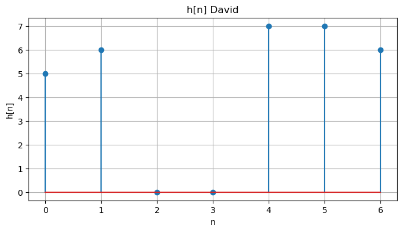
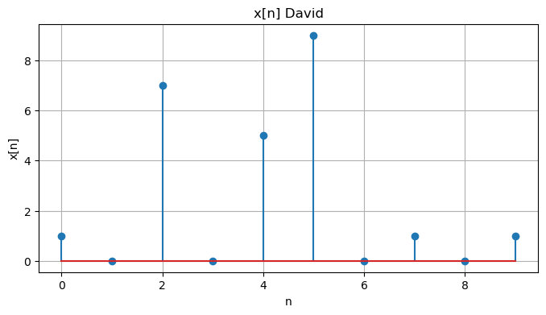
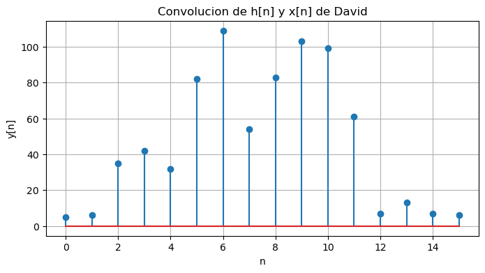
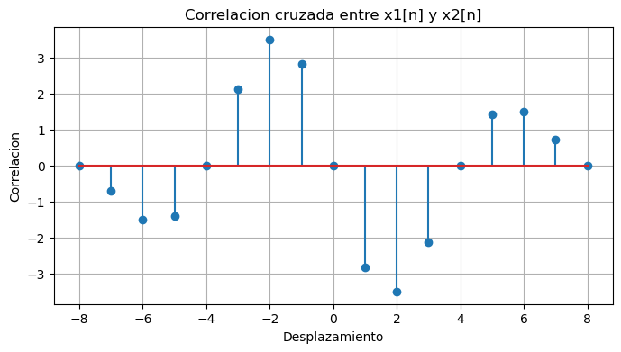
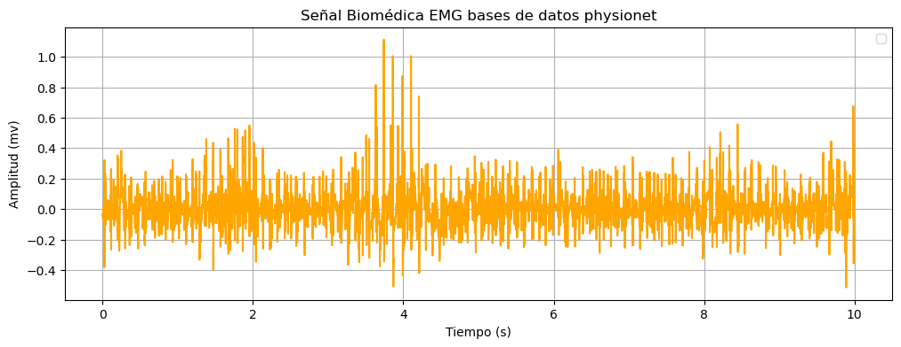
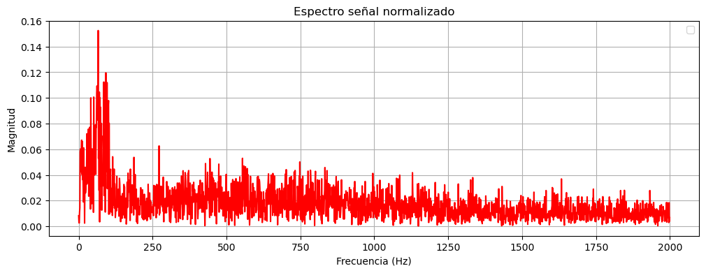
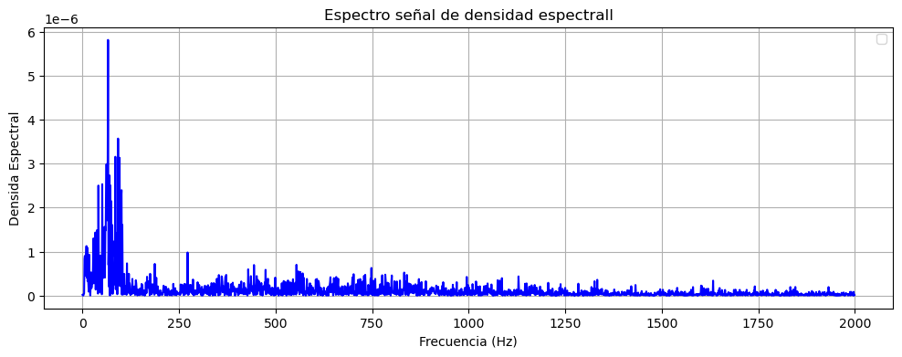
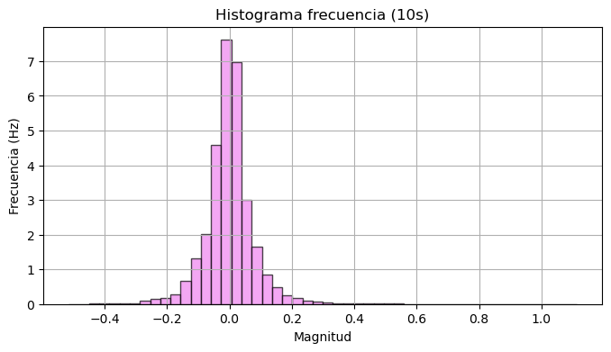

# PDS_LAB2

## PUNTO A 

En este primer análisis más que todo vemos cómo se graficaron cada uno de los códigos estudiantiles por separado, así mismo la cédula con su respectiva ubicación de cada punto con su respectiva línea. Cabe mencionar que ambos valores fueron definidos como x[n], que corresponde a la cédula de la persona, y h[n] al código estudiantil del mismo.

    x =np.array ([1,0,7,0,5,9,0,1,0,1])
    h =np.array ([5,6,0,0,7,7,6])

    #GRAFICA h[n] David
    t = np.arange(len(h))
    plt.figure(figsize=(8, 4))
    plt.stem(t, h)
    plt.xlabel('n')
    plt.ylabel('h[n]')
    plt.title('h[n] David')
    plt.grid()
    plt.show

    #GRAFICA x[n] David
    t = np.arange(len(x))
    plt.figure(figsize=(8, 4))
    plt.stem(t, x)
    plt.xlabel('n')
    plt.ylabel('x[n]')
    plt.title('x[n] David')
    plt.grid()
    plt.show

Como se observa los puntos x[n] y h[n] corresponden a lo valores establecidos con anterioridad; tras esto, se realizó la convolución de ambas gráficas.

Como ya sabemos la convulucion se entiende como una  operación matemática que combina dos funciones para describir la su posición entre ambas, la cual toma las dos funciones las desliza una sobre la otra, multiplica los valores de las funciones en todos los puntos de superposición, y suma los productos para crear una nueva función, en la gráfica siguiente se puede demostrar la convulsion ya que es la suma de la gráfica respeto a los valores de el código de cada uno con la gráfica de la cédula.

    y = np.convolve(x, h, mode='full')#se calcula la convolucion
    print("Señal convolucion entre h[n] y x[n], David")

El procedimiento anterior se realizó con el código y cédula de los demás integrantes del grupo (Sofia Conde, Dayanna Mora), así como la concolución de ambos datos.

## PUNTO B

Conforme al segundo análisis, limitado por las funciones: 𝑥1[𝑛𝑇𝑠] = cos(2𝜋100𝑛𝑇𝑠) 𝑝𝑎𝑟𝑎 0 ≤ 𝑛 < 9, y
𝑥2[𝑛𝑇𝑠] = sin(2𝜋100𝑛𝑇𝑠) 𝑝𝑎𝑟𝑎 0 ≤ 𝑛 < 9 𝑝𝑎𝑟𝑎 𝑇𝑠 = 1.25𝑚s. Se halló la correlación entre ambos valores dando como resultado:

    Ts = 1.25e-3 #Ts dado por la guía
    n = np.arange(9) #para 0<=n<=9
    f = 100 #100 nts
    x1 = np.cos(2 * np.pi * f * n * Ts) #x1(nTs) = cos(2pi100nts)
    x2 = np.sin(2 * np.pi * f * n * Ts) #x2(nTs) = sen(2pi100nts)
    correlacion = np.correlate(x1, x2, mode='full')
    print ("Correlación cruzado (vector o resultado", correlacion)

    #Grafica de correlacion
    t_corr = np.arange(-len(n) + 1, len(n))
    plt.figure(figsize=(8, 4))
    plt.stem(t_corr,correlacion)
    plt.xlabel("Desplazamiento")
    plt.ylabel("Correlacion")
    plt.title("Correlacion cruzada entre x1[n] y x2[n]")
    plt.grid()
    plt.show()  

    

 Frente al análisis del código destaca que los valores de tiempo (Ts) y frecuencia (f) ya habian sido establecidos por las propias fórmulas estbalecidas. En cuanto al resultado de su tabla destaca que el eje X tiene valores de -8 a 8, lo que indica que estás observando un rango de desplazamientos entre las dos señales y desde -8 hasta +8 muestras; el eje Y tiene un rango de -3 a 3, lo que significa que los valores de correlación cruzada varían en este intervalo.

 La forma general de la gráfica muestra un comportamiento de simetría con respecto al eje. Esta simetría es típica cuando se correlacionan señales periódicas con un desfase constante. La gráfica parece tener un pico en y=4 y luego decae en ambos sentidos. Esto refleja un patrón de correlación común entre señales como seno y coseno.

 Por último, la gráfica tiene un comportamiento que sigue la naturaleza de las señales seno y coseno, que están desfasadas. El valor cero es el lugar donde las señales son ortogonales y no se correlaciona. Los desplazamientos negativos y positivos reflejan el desfase de las señales en distintas posiciones a lo largo del tiempo, con una caída de la correlación a medida que las señales se desalinean.

## PUNTO C

Como último punto a trabajar, se descargó una señal de electromiofrafía, directamente de physionet, la muestra corresponde a la de un paciente sano, dando como resultado:

    record = wfdb.rdrecord(nombrearchivo)
    signal = record.p_signal[:,0]  
    fs = record.fs  #fs = periodo (T)
    numerodatos = len(signal) 
    limitartiempo=int(10*fs) #muestreo

    time = [i / fs for i in range(numerodatos)]  
    signal = signal[:limitartiempo]
    time = time[:limitartiempo]

    #DIBUJAR SEÑAL
    plt.figure(figsize=(12,4))
    plt.plot(time, signal, color="orange")
    plt.xlabel("Tiempo (s)")
    plt.ylabel("Amplitud (mv)")
    plt.title("Señal Biomédica EMG bases de datos physionet")
    plt.legend()
    plt.grid()
    plt.show()

La gráfica muestra la señal EMG en el dominio del tiempo. El eje horizontal representa el tiempo en segundos, mientras que el eje vertical representa la amplitud de la señal en milivoltios (mV). La señal EMG típicamente presenta fluctuaciones rápidas y aleatorias, lo que se observa claramente en la gráfica. Estas fluctuaciones corresponden a la actividad eléctrica de los músculos, que varía según la contracción y relajación muscular.

Esta gráfica tiene una duración de 10 segundos, con una amplitud entre los -0.4mv y 1.0mv, donde la señal tiene oscilaciones constantes con variaciones en la amplitud, nos permite estudiar fatiga, control neuromuscular o anomalías musculares. Adicionalmete, la señal parece estar centrada alrededor de un valor cercano a cero, lo que es característico de las señales EMG, ya que la actividad muscular es simétrica alrededor de un valor de reposo.

A diferencia de las señales ECG, que son periódicas, las señales EMG son aleatorias y no presentan patrones repetitivos claros. La amplitud de la señal puede variar significativamente dependiendo de la fuerza de la contracción muscular. En este caso, la amplitud parece estar en un rango moderado, lo que sugiere una actividad muscular no es demasido fuerte. Cabe mencionar que la señal descargada de phhysionet corresponde a la de un paciente sano, por tanto el EDM se comporta como tal.

### Estadística

Tras lo anterior se prosiguió a la estadístca a mano del EDM, en donde se usaron las siguientes funciones:

    #ESTADISTICA A MANO
    suma = 0
    for i in range(len(signal)):
        suma += signal[i]
    media = suma / len(signal)
    print(f"la media de la señal es: {media:.3f}")

    #VECTOR DE LONGITUD
    vector = 0
    for _ in signal:
    vector += 1
    print(f"la longitud del vector es: {vector}")

    #DESVIACION ESTANDAR
    desviacion = 0
    for i in range(len(signal)):
        desviacion += (signal[i] - media) ** 2
    desviacion_estandar = (desviacion / len(signal)) ** 0.5
    print(f"la desviacion estandar es: {desviacion_estandar:.3f}")

    #COEFICIENTE DE VARIACION
    coeficiente = desviacion_estandar / media if media != 0 else float("nan")
    print(f"El coeficiente es: {coeficiente:.3f}")

RESULTADOS:

La media de la señal es: 0.000

La longitud del vector es: 40000

La desviacion estandar es: 0.082

El coeficiente es: 199.203

La media de la señal es cero, lo que es típico en señales EMG, ya que la actividad muscular es simétrica alrededor de un valor de reposo. Un valor de media cercano a cero indica que no hay un sesgo significativo en la señal.

La longitud del vector representa el número de muestras en la señal. En este caso, se indica que se tomaron 40000 muestras para el EDM, esto se puede intuir de la frecuencia de muestreo (fs) de 4000, y el peridod de tiempo de 10s.

La desviación estándar mide la dispersión de los valores de la señal alrededor de la media. Al ser un valor bajo, de 0,082mV, se puede intuir que al ser una amplitud moderada la intensidad de la contracción muscular es leve, o incluso puede que no halla contracción

El coeficiente relaciona la desviación estándar con la media. Es útil para comparar la variabilidad de diferentes señales. En este caso, el coeficiente de variación es bajo (109,202), lo que confirma la alta variabilidad de la señal EMG, que aunque se intuye que el músculo está estatico, su valor se podria deber al ruido de los instrumentos de toma de señales.

Una vez realizado y analisado la estadística a mano, se prosigió a hallar esos mismos valores haciendo usos de las librerias correspondientes:

    #ESTADISTICOS CON FUNCIONES
    media_librerias = np.mean(signal)
    longitud_vector_librerias = len(signal)
    desviacion_librerias = np.std(signal)
    coeficiente_variacion_librerias = desviacion_librerias / media_librerias if media_librerias != 0 else np.nan

    print(f"Media de la señal con librerias: {media_librerias:.4f}")
    print(f"Longitud del vector con librerias: {longitud_vector_librerias}")
    print(f"Desviación estándar con librerias: {desviacion_librerias:.4f}")
    print(f"Coeficiente de variación con librerias: {coeficiente_variacion_librerias:.4f}")

RESULTADOS:

La media de 

La señal es: 0.0004

La longitud del vector es: 40000

La desviacion estandar es: 0.0820

El coeficiente es: 199.2026

Este bloque de código calcula los mismos estadísticos que en la sección anterior, pero utilizando funciones de numpy. Tal como se esperaba, los datos usando funciones coinciden casi exactamente con los datos establecidos a manos, con la diferencia que las funciones permiten una mayor exactitud dandod más cifras significativas.

### Transformada de Fourier

La transformada de Fourier convierte la señal del dominio del tiempo al dominio de la frecuencia, lo anterior permite analizar las frecuencias presentes en la señal. Por otro lado la magnitud del espectro (magnitud) muestra la amplitud de cada frecuencia. En una señal EMG, la energía suele concentrarse en las frecuencias bajas y medias (0-500 Hz), con un pico alrededor de 50-150 Hz.

La gráfica muestra el espectro normalizado, lo que facilita la comparación con otras señales.

    frecuencia = np.fft.fftfreq(N, 1/fs) #muestreo
    spectrum = np.fft.fft(signal) / N
    magnitud = 2 * np.abs(spectrum[:N//2]) ##cantidad de canales

    plt.figure(figsize=(12,4))
    plt.plot(frecuencia[:N//2], magnitud, color="red")
    plt.xlabel("Frecuencia (Hz)")
    plt.ylabel("Magnitud")
    plt.title("Espectro señal normalizado")
    plt.legend()
    plt.grid()
    plt.show()

En cuanto el análisis del código detsaca que a normalización de la transformada de Fourier (/ N) es importante para asegurar que la magnitud del espectro sea proporcional a la amplitud de la señal original. Agrgando, l uso de 2 * np.abs(spectrum[:N//2]) es necesario para obtener la magnitud correcta en el espectro de frecuencias positivas.

Cabe mencionar que, "np.fft.fft" calcula la transformada de Fourier de una señal en el dominio del tiempo, convirtiéndola al dominio de la frecuencia. Devuelve un arreglo de números complejos que representan las amplitudes y fases de las frecuencias presentes en la señal

En cuanto al análisis de la gráfica de espectro nos permite observar cómo se distribuye la energía en diferentes frecuencias, esta gráfica presenta una normalización de la magnitud lo que facilita la comparación relativa entre distintas frecuencias, la escala de frecuencia llega a los 2.000 Hz, comparándola con otra señal muestran una señal típica de un paciente sano donde la actividad muscular se concentra en bajas frecuencias mayores a los 500Hz, tal como se mencionó al principio; por último la gráfica dada muestra mayor densidad de interferencia que la gráfica estudiada la cual nos muestra una señal filtrada.

### Densidad Espectral

La densidad espectral representa la distribución de la potencia de la señal en función de la frecuencia. Es útil para identificar las frecuencias que contribuyen más a la energía total de la señal.

En una señal EMG, esta suele mostrar un pico en el rango de 50-150 Hz, que corresponde a la actividad muscular. Frecuencias más altas pueden estar asociadas con ruido o artefactos. La gráfica de la PSD permite identificar bandas de frecuencia dominantes, lo que es útil para diseñar filtros o analizar la calidad de la señal.

    ##DENSIDAD ESPECTRAL
    psd = (magnitud ** 2) / N

    plt.figure(figsize=(12,4))
    plt.plot(frecuencia[:N//2], psd, color="blue")
    plt.xlabel("Frecuencia (Hz)")
    plt.ylabel("Densida Espectral")
    plt.title("Espectro señal de densidad espectral")
    plt.legend()
    plt.grid() 
    plt.show()

La desnsidad se calcula como (magnitud ** 2) / N, lo que asegura que la potencia esté correctamente normalizada. Este mismo procesos también se realizó en la transformada de Fourier.

En esta señal se ve una gran acumulación de energía en frecuencias bajas (bajo 150 Hz), con un pico destacado cerca de los 50 Hz. Esto indica que la señal tiene componentes importantes en esas frecuencias, de lo que se presupone es la ctivación muscular hablada anteriormente. Cuando la frecuencia sube, la densidad espectral baja notablemente; el espectro podría estar mostrando la existencia de una componente periódica fuerte alrededor de 50 Hz, con algunos armónicos menores.

### FRECIUENCIA, MEDIA, MEDIANA E HISTOGRAMA

Por último se hallaron los valores indicados por medio del siguienete programa:

    suma = 0
    for i in range(len(magnitud)):
        suma += magnitud[i]
    media = suma / len(magnitud)
    print(f"La media de la señal es: {media:.3f}")

    desviacion = 0
    for i in range(len(magnitud)):
        desviacion += (magnitud[i] - media) ** 2
    desviacion_estandar = (desviacion / len(magnitud)) ** 0.5
    print(f"La desviación estándar es: {desviacion_estandar:.3f}")

    plt.figure(figsize=(8, 4))
    plt.hist(signal, bins=50, color='violet', alpha=0.7, edgecolor='black', density=True)
    plt.xlabel("Magnitud")
    plt.ylabel("Frecuencia (Hz)")
    plt.title("Histograma frecuencia (10s)")
    plt.grid()
    plt.show()

La media de la señal es: 0.018

La desviacion estandar es: 0.014

Media de la señal con librerias: 0.0004

Desviación estándar con librerias: 0.0820

El objetivo de esta última parte del código fue, a parte de graficar el hitograma, determinar lo valores ya especificados de la misma. Comenzando, la media calculada manualmente (0.018) es diferente a la media calculada con librerías (0.0004). Esto se debe a que la media manual se calcula sobre las magnitudes de la transformada de Fourier, en cambio, la media con librerías se calcula sobre la señal original en el dominio del tiempo.

Frente a la desviación estándar manual (0.014) es mucho menor que la calculada con librerías (0.0820). Esto se debe a la misma razón por la que el valor de la media también es distinta.

El histograma muestra la distribución de las amplitudes de la señal original, que está centrada alrededor de 0 y tiene una dispersión moderada (consistente con la desviación estándar de 0.0820).

Este histograma representa la distribución de la magnitud de una señal a lo largo del tiempo, mostrando la frecuencia con la que aparecen distintos valores de magnitud en intervalos de 10 segundos, la mayor parte de la magnitud se encuentra entre -0.2 y 0.2, lo que indica que la señal es baja y estable sin valores extremos, por lo que podemos sugerir que el análisis de la electromiografia indica un músculo en reposo o con actividad muy baja ya que no hay una gran variabilidad en las magnitudes. Todo lo anterior ya se vino confirmando a través de todas la gráficas anteriores
